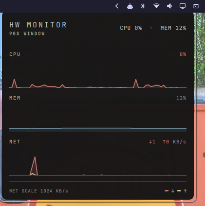

# HW Monitor — Omarchy panel plugin

Live CPU / MEM / NET sparkline monitor running **inside the omarchy-shell
process** — no separate Quickshell instance, no build step, no extra runtime
dependencies. A small floating panel (400x394, top-right corner) that toggles
with a keybind and samples `/proc` while visible.

<p>
</p>

## Features

- **CPU** — usage from a `/proc/stat` delta (two snapshots 0.15 s apart).
- **MEM** — used memory from `/proc/meminfo`.
- **NET** — real-time transfer from cumulative `/proc/net/dev` counters,
  loopback excluded so localhost chatter doesn't count as traffic.
- Self-contained palette — no dependency on Omarchy's `qs.Commons`/`qs.Ui`
  singletons, all colors live in `Hwmon.qml`.
- Power-friendly — while the panel is hidden the whole plugin is unloaded, so
  no probe timers run in the background.

## Requirements

- Omarchy (omarchy-shell) with a `hyprland.lua` config — the window rule and
  keybind are applied through Omarchy's Lua bridge (`o.window`, `o.bind`).
- `jq` — used by `install.sh` to poll the shell's plugin registry.
- Hyprland, with the window rule registered (the compositor tiles the
  `FloatingWindow` by default; see [Window rules](#window-rules)).

## File layout

```
manifest.json   plugin manifest: id "gennaro.hwmon", kinds: ["panel"]
Hwmon.qml       entry point: Item root + the "HW Monitor" FloatingWindow
GraphRow.qml    one labelled sparkline row (shared with the standalone widget)
Sparkline.qml   Canvas repaint helper (repaints only on series reassignment)
install.sh      install/uninstall helper that also wires up Hyprland
demo/           demo recording
```

## Install

```bash
./install.sh
```

This:

1. copies this folder to `~/.config/omarchy/plugins/gennaro.hwmon/` and
   validates it (`omarchy plugin validate`);
2. enables the plugin, forcing `omarchy-shell shell rescanPlugins` and polling
   `listPlugins` until the running shell knows the id (a bare `omarchy plugin
   enable` fails with "not known" while the registry still holds a pre-copy
   scan);
3. wires the Hyprland config inside `-- [hwmon-plugin]` marker blocks — the
   window rule in `hyprland.lua` and a `SUPER+F5` toggle in `bindings.lua`.

Every file the script touches is backed up to `*.bak.<timestamp>` first.
Idempotent: re-running replaces the managed blocks in place and refuses to
touch files that already carry hwmon content written by something else.

Manual equivalent:

```bash
cp -r . ~/.config/omarchy/plugins/gennaro.hwmon
omarchy plugin enable gennaro.hwmon
# if the shell doesn't pick it up: omarchy-shell shell rescanPlugins
```

## Uninstall

```bash
./install.sh uninstall
```

disables and removes the plugin (`omarchy plugin disable` / `omarchy plugin
remove --yes`), deletes the plugin folder, strips the `-- [hwmon-plugin]`
marker blocks from `hyprland.lua` and `bindings.lua`, and reloads Hyprland.
The window closes as soon as the plugin is disabled. As with install, every
touched file is backed up first.

## Toggle

```bash
omarchy-shell shell toggle gennaro.hwmon
```

or with the keybind `install.sh` sets up in `~/.config/hypr/bindings.lua`:

```lua
o.bind("SUPER + F5", "HW Monitor", "omarchy-shell shell toggle gennaro.hwmon")
```

## Window rules

The window is a `FloatingWindow` titled `HW Monitor` (400x394). Hyprland tiles
it by default, so the rule in `~/.config/hypr/hyprland.lua` is:

```lua
o.window({ title = "^(HW Monitor)$" }, { float = true, size = { 400, 394 }, move = { "(monitor_w-window_w-20)", "(20)" } })
```

This keeps it floating at 400x394 in the **top-right corner** with a 20px
margin. `install.sh` applies this automatically.

> **Gotcha:** the `move` table form with `monitor_w`/`window_w` variables is
> required. The string form `move = "100%-w-20 20"` is silently ignored by the
> hyprland-lua bridge on current Hyprland builds — `hyprctl configerrors` stays
> clean, so a missing rule can be easy to miss.

If you change the widget's layout in `Hwmon.qml`, keep `implicitWidth` /
`implicitHeight` and the rule's `size` in sync — the size math is hand-computed
and coupled.

## Development

- `omarchy plugin validate <folder>` — schema-check a plugin folder before
  installing.
- Saving any file under `~/.config/omarchy/plugins/` auto-reloads the plugin;
  `omarchy-shell shell rescanPlugins` forces a rescan.
- Series arrays are **reassigned** via spread + slice (`Sparkline.qml` is a
  `Canvas` that repaints only on series reassignment — never push in place).